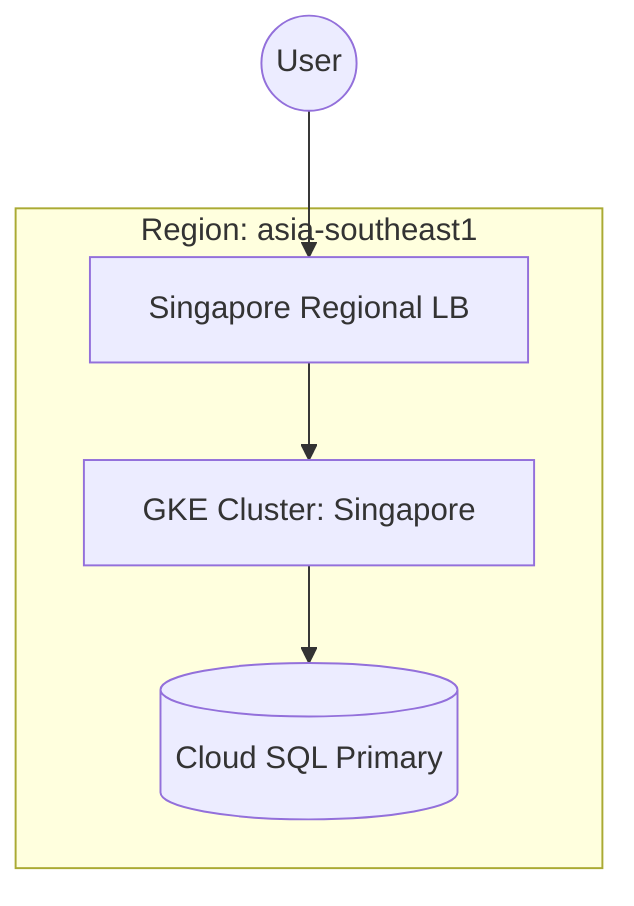
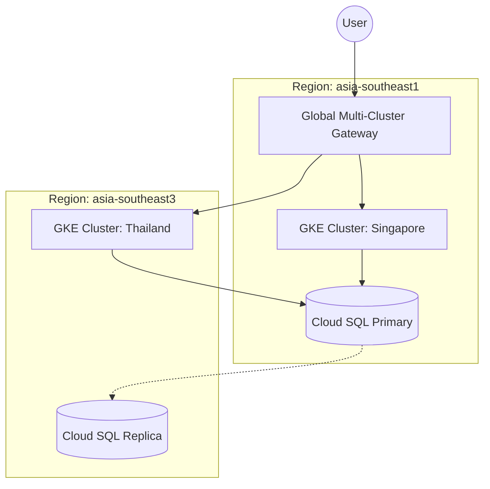
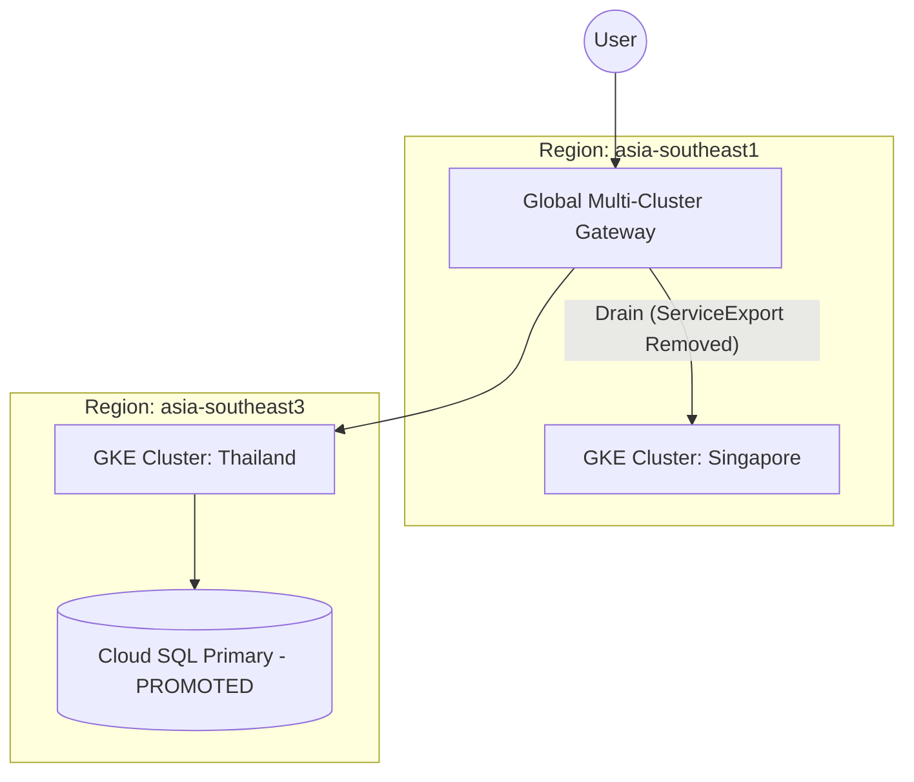
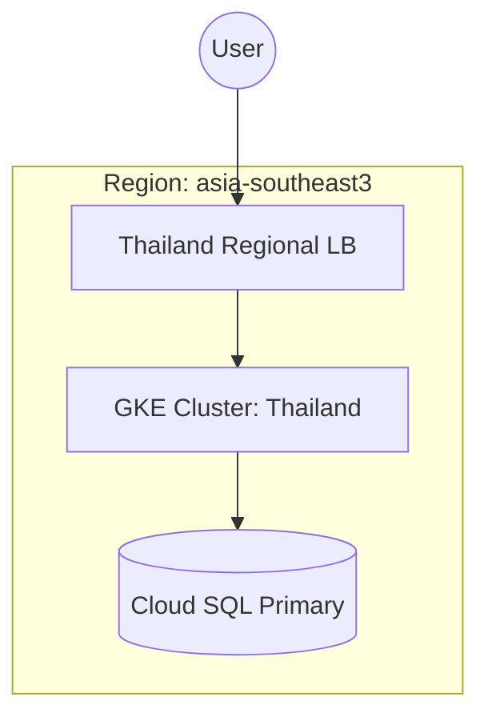

# Multi-Cluster / Multi-Region Migration Demo on GCP

This project demonstrates a multi-region active-active deployment and a zero-downtime migration strategy using **Google Kubernetes Engine (GKE)**, **Multi-Cluster Gateway (MCG)**, and **Cloud SQL with Cross-Region Replicas**.

## Architecture Overview

1.  **GCP Multi-Cluster Gateway**: A global L7 load balancer that routes user traffic across clusters in different regions based on proximity, health, and custom weights.
2.  **GKE Clusters**: Two clusters (`cluster-sg` in `asia-southeast1`, `cluster-th` in `asia-southeast3`) registered to a single GCP Fleet.
3.  **Application**: A simple Python FastAPI service that connects to PostgreSQL and exposes a `/status` endpoint for verifying the routing behavior.
4.  **Database**: Cloud SQL (PostgreSQL) running a Primary in `asia-southeast1` (Singapore) and a Read Replica in `asia-southeast3` (Thailand).

## Project Structure

*   `app/`: Python FastAPI backend application and Dockerfile.
*   `k8s/`: Kubernetes manifests (Deployment, Service, ServiceExport, Gateway, HTTPRoute).
*   `scripts/`: Testing tools (`test_failover.py`) to demonstrate zero downtime.
*   `infra/`: Infrastructure directory (add your Terraform/scripts here).

# GKE Multi-Region Migration Demo

This repository contains a structured, three-stage demonstration of a zero-downtime regional migration from **Singapore (asia-southeast1)** to **Thailand (asia-southeast3)**.

## Demo Stages

This section details the architectural evolution of the solution across the four stages of migration.

### Stage 1: Initial Baseline (Singapore)

In this stage, the application is hosted entirely in the Singapore region (`asia-southeast1`).



*   **Logic**: A standard single-region deployment. A regional L7 Load Balancer (GKE Ingress or Service type: LoadBalancer) routes traffic to the Singapore GKE cluster. The application connects to a local Cloud SQL Primary instance.
*   **Purpose**: Establishes the performance and availability baseline before migration.

---

### Stage 2: Regional Expansion (Thailand & Global Gateway)

We expand the footprint to Thailand (`asia-southeast3`) and introduce the Global Multi-Cluster Gateway.



*   **Logic**: 
    *   **Traffic**: A Global Multi-Cluster Gateway (MCG) is deployed. It uses GKE Fleet Hub and Multi-Cluster Services (MCS) to "export" services from both clusters.
    *   **Data**: A Cloud SQL Read Replica is created in Thailand to prepare for failover.
    *   **Routing**: The MCG can route traffic to both regions. Initially, it can be configured to favor Singapore or split traffic.
*   **Purpose**: Enables multi-region capabilities and prepares the infrastructure for a seamless transition.

---

### Stage 3: Controlled Migration (Switch-Over)

Traffic is shifted entirely to Thailand, and the database is promoted.



*   **Logic**:
    *   **Traffic Shift**: The `ServiceExport` resource is removed from the Singapore cluster. The Global Gateway detects this and gracefully drains traffic, directing all new requests to Thailand.
    *   **Database Promotion**: The Thailand Read Replica is promoted to a standalone Primary instance. The application in Thailand is updated to point to the new local Primary.
*   **Purpose**: Executes the migration with zero downtime by leveraging the Global Load Balancer's ability to shift traffic dynamically.

---

### Stage 4: Post-Migration (Settle in Thailand)

The migration is finalized by returning to a simplified regional setup in Thailand.



*   **Logic**: 
    *   **Simplification**: Once the migration is verified, a regional Load Balancer is provisioned in Thailand.
    *   **Cleanup**: The Multi-Cluster Gateway, the Singapore GKE cluster, and the old Singapore database are decommissioned to reduce complexity and cost.
*   **Purpose**: Reaches the final "steady state" in the new region, identical in simplicity to the starting point but in a different geography.

## Detailed Demo Instructions

To run the demo, execute the scripts for each stage in order.

### Step 1: Initial Baseline (Singapore)
Set up the primary environment in Singapore.
```bash
./demo_stages/01_setup_singapore.sh
```

### Step 2: Regional Expansion (Thailand & Global Gateway)
Add the Thailand region and introduce the Multi-Cluster Gateway (MCG).
```bash
./demo_stages/02_setup_thailand.sh
```

### Step 3: Controlled Migration (Switch-Over)
Perform the actual migration between regions using the Gateway.
```bash
# Migrate from Singapore to Thailand
./demo_stages/03_regional_switch.sh singapore thailand
```

### Step 4: Post-Migration (Settle in Thailand)
Once the migration is complete, settle back to a standard Regional Load Balancer in Thailand.
```bash
./demo_stages/04_post_migration.sh
```

### Repeatability & Fail-back
To migrate back to Singapore (Stage 4):
1.  **Re-establish Replication**: Set up a new read-replica in Singapore from the Thailand primary.
2.  **Run Switch-back**:
    ```bash
    ./demo_stages/03_regional_switch.sh thailand singapore
    ```
3.  **Finalize**: Promote the Singapore replica and update the app configuration.
